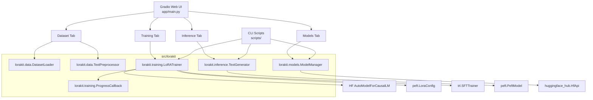

# LoRA Finetune Studio

[](https://python.org)
[](https://opensource.org/licenses/MIT)
[](https://huggingface.co/PunyaModi/mistral-7b-finetuned-Midjourney-prompt-v2)
[](https://gradio.app)
[](https://pytorch.org)

A production-quality, full-stack LoRA fine-tuning studio for large language models. Built with a Gradio web UI, CLI scripts, and a clean Python library (`lorakit`) that wraps `transformers`, `peft`, and `trl`.

Originally created to fine-tune **Mistral 7B** on a Midjourney prompt creation dataset — now a general-purpose platform supporting 11+ base models, 4 prompt templates, batch inference, and one-click push to Hugging Face Hub.

> 🤗 **Published fine-tuned model:** [PunyaModi/mistral-7b-finetuned-Midjourney-prompt-v2](https://huggingface.co/PunyaModi/mistral-7b-finetuned-Midjourney-prompt-v2)

---

## ✨ Features

- **Web UI** — 4-tab Gradio interface: Dataset, Training, Inference, Models
- **QLoRA** — 4-bit and 8-bit quantization via `bitsandbytes` for low-VRAM training
- **11+ Base Models** — Mistral, Llama 2/3, CodeLlama, Gemma, Phi-2, TinyLlama
- **4 Prompt Templates** — `raw`, `instruction`, `chat` (Mistral format), `alpaca`
- **Live Training Logs** — Real-time loss curve and step-by-step log table
- **Streaming Inference** — Token-by-token streaming generation
- **Batch Inference** — CSV upload for bulk generation with download
- **Model Manager** — List, inspect, delete, push/pull models from Hub
- **CLI Scripts** — `train.py`, `generate.py`, `export_model.py` (merge LoRA weights)
- **Docker** — GPU-enabled docker-compose for one-command deployment
- **Tests** — pytest suite covering config, dataset loading, preprocessing

---

## 🏗️ Architecture



---

## 🗂️ Directory Structure

```
lora-finetune-studio/
├── src/
│   └── lorakit/               # Core Python library
│       ├── config.py          # Dataclass configs (ModelConfig, LoRAConfig, etc.)
│       ├── data/              # Dataset loading and preprocessing
│       ├── training/          # LoRA trainer + callbacks
│       ├── inference/         # Text generation
│       ├── models/            # Model management + Hub integration
│       └── utils/             # Logging, metrics
├── app/
│   ├── main.py                # Gradio app entry point
│   └── components/            # Per-tab UI components
├── scripts/                   # CLI: train.py, generate.py, export_model.py
├── notebooks/                 # quickstart.ipynb, midjourney_finetuning.ipynb
├── tests/                     # pytest suite
├── docker/                    # Dockerfile + docker-compose.yml
├── data/examples/             # Example datasets
├── pyproject.toml
├── requirements.txt
└── Makefile
```

---

## 🚀 Quick Start

### 1. Clone and install

```bash
git clone https://github.com/punyamodi/lora-finetune-studio.git
cd lora-finetune-studio
pip install -r requirements.txt
pip install -e .
```

### 2. Launch the Web UI

```bash
python -m app.main
# or
make run-ui
```

Open `http://localhost:7860` in your browser.

### 3. Train via CLI

```bash
python scripts/train.py \
  --model mistralai/Mistral-7B-v0.1 \
  --data train.csv \
  --output ./outputs/my-model \
  --epochs 3 \
  --use-4bit \
  --template raw
```

### 4. Generate text

```bash
python scripts/generate.py \
  --model ./outputs/my-model \
  --base-model mistralai/Mistral-7B-v0.1 \
  --prompt "Create a Midjourney prompt for a cyberpunk cityscape" \
  --max-new-tokens 200
```

---

## 🖥️ Web UI Guide

### Dataset Tab

1. Upload a CSV file or enter a Hugging Face dataset ID
2. View statistics (row count, columns, memory)
3. Preview the first 10 rows
4. Select text/prompt/response columns
5. Choose a prompt template and preview the formatted output

### Training Tab

Configure:
- **Base Model** — dropdown with 8 popular models
- **LoRA** — rank `r`, alpha, dropout, target modules
- **Training** — epochs, batch size, learning rate, gradient accumulation
- **Dataset** — upload CSV, select template, prompt/response columns
- **Hub** — optional push to Hugging Face Hub after training

Click **Start Training** to begin. Live loss curve and log table update during training.

### Inference Tab

1. Select model source (local path or Hub ID)
2. Optionally specify base model if loading a LoRA adapter
3. Load the model
4. Enter a prompt and click **Generate**
5. Adjust generation parameters (temperature, top-p, top-k, etc.)
6. Run **Batch Inference** with a CSV of prompts

### Models Tab

- List all local models in a directory
- Inspect adapter config of any model
- Delete models from disk
- Push a local model to Hugging Face Hub
- Download any model from Hub
- Browse the supported base models table

---

## 🐍 Python API

```python
from lorakit.config import FullConfig, ModelConfig, LoRAConfig, DataConfig, TrainingConfig
from lorakit.data.dataset import DatasetLoader
from lorakit.training.trainer import LoRATrainer
from lorakit.inference.generator import TextGenerator

config = FullConfig(
    model=ModelConfig(model_name="mistralai/Mistral-7B-v0.1", use_4bit=True),
    lora=LoRAConfig(r=16, lora_alpha=32),
    data=DataConfig(train_file="train.csv", max_seq_length=512),
    training=TrainingConfig(output_dir="./outputs", num_train_epochs=3),
)

loader = DatasetLoader(config.data)
dataset = loader.load()

trainer = LoRATrainer(config)
result = trainer.train(dataset, prompt_template="raw")

generator = TextGenerator(
    model_path="./outputs",
    base_model="mistralai/Mistral-7B-v0.1",
    load_in_4bit=True,
)
generator.load()
outputs = generator.generate("Create a prompt for a sunset painting", max_new_tokens=200)
print(outputs[0])
```

---

## ⚙️ Configuration Reference

### ModelConfig

| Parameter | Default | Description |
|-----------|---------|-------------|
| `model_name` | `mistralai/Mistral-7B-v0.1` | HF model ID |
| `use_4bit` | `True` | Enable 4-bit quantization |
| `use_8bit` | `False` | Enable 8-bit quantization |
| `bnb_4bit_compute_dtype` | `float16` | Compute dtype for 4-bit |
| `bnb_4bit_quant_type` | `nf4` | Quantization type (`nf4`/`fp4`) |
| `use_nested_quant` | `False` | Double quantization |

### LoRAConfig

| Parameter | Default | Description |
|-----------|---------|-------------|
| `r` | `16` | LoRA rank |
| `lora_alpha` | `32` | LoRA alpha (scaling) |
| `target_modules` | `[q_proj, k_proj, v_proj, o_proj]` | Modules to apply LoRA |
| `lora_dropout` | `0.05` | Dropout in LoRA layers |
| `bias` | `none` | Bias training mode |
| `task_type` | `CAUSAL_LM` | Task type for PEFT |

### DataConfig

| Parameter | Default | Description |
|-----------|---------|-------------|
| `train_file` | `train.csv` | Path to training CSV |
| `text_column` | `text` | Column with raw text |
| `prompt_column` | `None` | Column for instruction |
| `response_column` | `None` | Column for response |
| `max_seq_length` | `512` | Max token length |
| `val_split` | `0.1` | Validation split ratio |

### TrainingConfig

| Parameter | Default | Description |
|-----------|---------|-------------|
| `output_dir` | `./outputs` | Where to save checkpoints |
| `num_train_epochs` | `3` | Total training epochs |
| `per_device_train_batch_size` | `4` | Batch size per GPU |
| `gradient_accumulation_steps` | `1` | Steps before optimizer update |
| `learning_rate` | `2e-4` | Peak learning rate |
| `optimizer` | `paged_adamw_32bit` | Optimizer type |
| `lr_scheduler_type` | `cosine` | LR schedule |
| `warmup_ratio` | `0.03` | Warmup fraction |
| `fp16` | `True` | Mixed precision FP16 |
| `push_to_hub` | `False` | Auto-push after training |

---

## 🐳 Docker

### Build and run with GPU support

```bash
# Copy and set environment variables
cp .env.example .env
# Edit .env and set HF_TOKEN

# Build and start
docker-compose -f docker/docker-compose.yml up --build
```

The UI will be available at `http://localhost:7860`.

### Dockerfile

The image is based on `pytorch/pytorch:2.1.0-cuda12.1-cudnn8-runtime` and installs all dependencies. Mount `data/`, `outputs/`, and `models/` as volumes to persist state between runs.

---

## 🧪 Tests

```bash
pytest tests/ -v
```

Tests cover:
- `test_config.py` — dataclass defaults and custom values
- `test_dataset.py` — CSV loading, split creation, stats
- `test_preprocessing.py` — all 4 prompt template formatters

---

## 📊 Prompt Templates

| Template | Format |
|----------|--------|
| `raw` | Raw text column as-is |
| `instruction` | `### Instruction:\n{instruction}\n\n### Response:\n{response}` |
| `chat` | `<s>[INST] {instruction} [/INST] {response}</s>` (Mistral format) |
| `alpaca` | `### Human: {instruction}\n### Assistant: {response}` |

---

## 🤖 Supported Base Models

| Model | Hub ID |
|-------|--------|
| Mistral 7B v0.1 | `mistralai/Mistral-7B-v0.1` |
| Mistral 7B Instruct v0.2 | `mistralai/Mistral-7B-Instruct-v0.2` |
| Llama 2 7B | `meta-llama/Llama-2-7b-hf` |
| Llama 2 13B | `meta-llama/Llama-2-13b-hf` |
| Llama 2 7B Chat | `meta-llama/Llama-2-7b-chat-hf` |
| Llama 3 8B | `meta-llama/Meta-Llama-3-8B` |
| CodeLlama 7B | `codellama/CodeLlama-7b-hf` |
| Gemma 2B | `google/gemma-2b` |
| Gemma 7B | `google/gemma-7b` |
| Phi-2 | `microsoft/phi-2` |
| TinyLlama 1.1B | `TinyLlama/TinyLlama-1.1B-Chat-v1.0` |

---

## 🎨 Original Model: Mistral 7B Fine-tuned on Midjourney Prompts

This repository originated from a fine-tuning experiment on a Midjourney prompt creation dataset. The resulting model is published at:

> **[PunyaModi/mistral-7b-finetuned-Midjourney-prompt-v2](https://huggingface.co/PunyaModi/mistral-7b-finetuned-Midjourney-prompt-v2)**

The model was fine-tuned on a custom dataset specifically curated for midjourney prompt creation tasks. It can generate prompts or suggestions for various creative scenarios — particularly those that require guidance midway through a creative process.

### Usage (original model)

```python
from transformers import AutoTokenizer, AutoModelForCausalLM

tokenizer = AutoTokenizer.from_pretrained("PunyaModi/mistral-7b-finetuned-Midjourney-prompt-v2")
model = AutoModelForCausalLM.from_pretrained("PunyaModi/mistral-7b-finetuned-Midjourney-prompt-v2")

def generate_prompt(input_text, max_length=50, num_return_sequences=3):
    input_ids = tokenizer.encode(input_text, return_tensors="pt")
    output = model.generate(
        input_ids=input_ids,
        max_length=max_length,
        num_return_sequences=num_return_sequences,
        temperature=0.7,
    )
    return [tokenizer.decode(seq, skip_special_tokens=True) for seq in output]

input_text = "You're halfway through your project and feeling stuck. What should you do next?"
prompts = generate_prompt(input_text)
for prompt in prompts:
    print(prompt)
```

### Using with lorakit (recommended)

```python
from lorakit.inference.generator import TextGenerator

generator = TextGenerator(
    model_path="PunyaModi/mistral-7b-finetuned-Midjourney-prompt-v2",
    load_in_4bit=True,
)
generator.load()

outputs = generator.generate(
    prompt="Create a Midjourney prompt for a futuristic cityscape at golden hour",
    max_new_tokens=200,
    temperature=0.7,
    top_p=0.9,
)
print(outputs[0])
```

---

## 📁 Training Dataset

The dataset (`train.csv`) contains Midjourney-style creative prompts. The model was trained using the `raw` template — each row in the CSV is a complete text sample.

Dataset characteristics:
- Creative, descriptive image generation prompts
- Mix of artistic styles, subjects, and moods
- Formatted as standalone text suitable for causal language modeling

---

## 🔧 Export Merged Model

To merge LoRA adapter weights into the base model (for standalone deployment):

```bash
python scripts/export_model.py merge \
  --base-model mistralai/Mistral-7B-v0.1 \
  --adapter ./outputs/my-lora-adapter \
  --output ./outputs/merged-model
```

---

## 📜 Citation

If you use this code or the published model in your work, please cite:

```bibtex
@misc{lorafinetunestudio2024,
  title={LoRA Finetune Studio},
  author={Punya Modi},
  year={2024},
  publisher={GitHub},
  howpublished={\url{https://github.com/punyamodi/lora-finetune-studio}},
}
```

Original Mistral model:
```bibtex
@article{jiang2023mistral,
  title={Mistral 7B},
  author={Jiang, Albert Q. and Sablayrolles, Alexandre and Mensch, Arthur and others},
  journal={arXiv preprint arXiv:2310.06825},
  year={2023}
}
```

---

## 🙏 Acknowledgments

- [Hugging Face](https://huggingface.co) — `transformers`, `peft`, `trl`, `datasets`, `huggingface_hub`
- [Tim Dettmers](https://github.com/TimDettmers) — `bitsandbytes` for QLoRA quantization
- [Gradio](https://gradio.app) — Web UI framework
- [Mistral AI](https://mistral.ai) — Mistral 7B base model

---

## 📬 Contact

**Punya Modi** — [modipunya@gmail.com](mailto:modipunya@gmail.com)

- GitHub: [punyamodi](https://github.com/punyamodi)
- HuggingFace: [PunyaModi](https://huggingface.co/PunyaModi)

---

## 📄 License

MIT License — see [LICENSE](LICENSE) for details.
